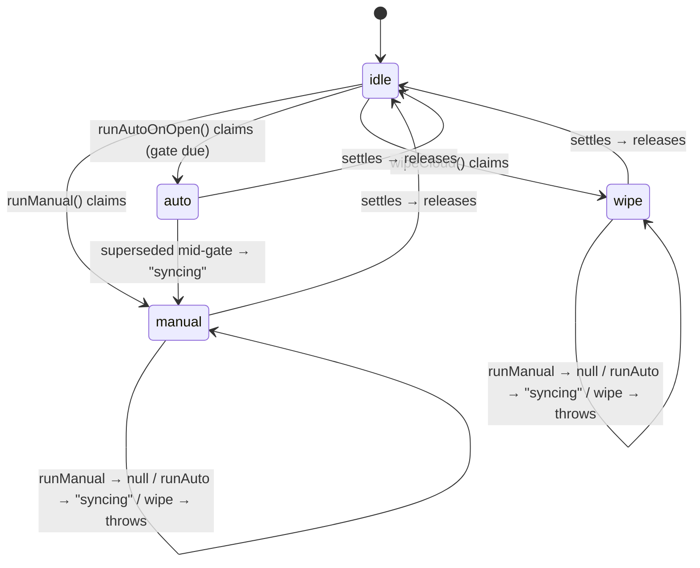
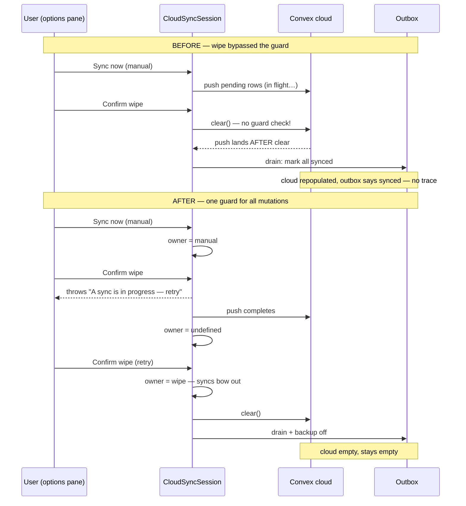
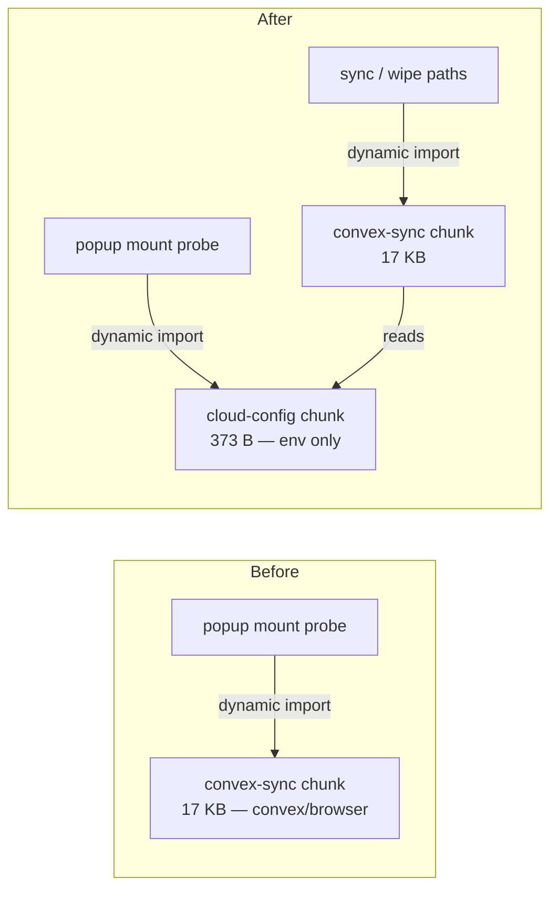
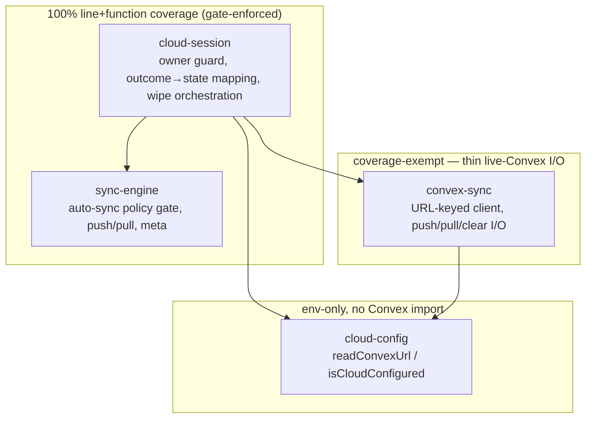

# Architecture Gains — Cloud-Session Review Round (2026-07-19)

Context: post-merge review of the Candidate B cloud-session range (`1e3b761..9af8785`),
followed by three fix PRs — [#22](https://github.com/fpcMotif/xblocker/pull/22),
[#23](https://github.com/fpcMotif/xblocker/pull/23),
[#24](https://github.com/fpcMotif/xblocker/pull/24) — all merged, main green.

## Main findings

| # | Severity | Finding | Fix (PR) |
|---|----------|---------|----------|
| 1 | CRITICAL | `main` red since the Candidate B merge: `clearDefaultCloud`'s happy path structurally uncoverable → 100% coverage gate failed every CI run | Moved configured-check + clear into coverage-exempt `convex-sync.clearCloud()`; default port is a one-line delegate (#22) |
| 2 | WARNING | `wipeCloud` bypassed the session's `owner` guard — an in-flight push could land after `clear()`, silently repopulating a wiped cloud with no local trace | `wipeCloud` refuses while a sync holds the guard and holds `owner: "wipe"` itself (#22) |
| 3 | WARNING | `client()` cached the first-seen `VITE_CONVEX_URL` for the process — the lazy-read fix only half-delivered | Client cache keyed by URL (#23) |
| 4 | SUGGESTION | Configured probe imported `convex-sync` → fetched the 17KB Convex chunk on every popup open, configured or not | New env-only `cloud-config` module; probe fetches a 373-byte chunk (#23) |
| 5 | SUGGESTION | `runAutoOnOpen` discarded error identity | `console.warn` on failure, repo convention (#24) |
| 6 | NITPICK | CI workflow ran with default permissive token | `permissions: contents: read` (#24) |

## Gain 1 — the in-flight guard is now a total invariant

Before, `owner` coordinated syncs but the wipe bypassed it — mutual exclusion that
looked complete but wasn't. Now every cloud mutation shares one guard.

The race that motivated it, and the behavior now:

## Gain 2 — config is split from transport

`cloud-config` (env-only, zero imports) vs `convex-sync` (Convex client). Answering
"is this build configured?" no longer loads the transport — verified in the build's
chunk output, not just by intent.

## Gain 3 — every line sits in a module that can honestly own it

Live-I/O guards live in the coverage-exempt thin wrapper (`convex-sync`);
orchestration logic lives in the 100%-tested module (`cloud-session`). The gate is
green **without** re-introducing the process-global `mock.module` debt the merge
worked to remove — testability now comes from the module boundaries themselves.

Net effect: the module boundaries are honest — the coordination invariant is complete,
and the dependency graph matches ADR-0003's cost model ("an unconfigured build never
pays for the Convex bundle") along every path, probe included.
